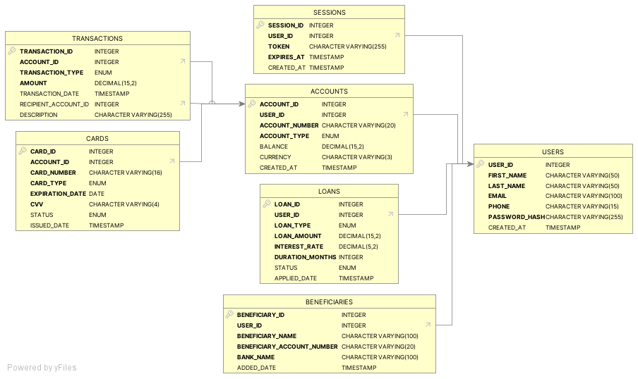

# Welcome to the Crédit Apicole!

This is a banking application providing services to a customer. The main goal is to provide a thorough example of the development of a Java application.

For a quickstart, you can use the following Docker deployment:

docker compose up

Then you can navigate to the website at http://localhost:80

# Spécification des Exigences Logiciels (SRS) - Application Bancaire

## Introduction

### Objectif

L'objectif de cette application bancaire est de permettre aux utilisateurs de gérer leurs comptes, effectuer des transactions, suivre leurs finances et accéder à des services financiers en toute sécurité via une plateforme web et mobile.

### Portée

L'application couvre :

La gestion des comptes bancaires

Les dépôts, retraits et virements

La gestion des cartes bancaires (débit/crédit)

La gestion des prêts

La sécurité et l'authentification forte

Une interface utilisateur intuitive sur mobile et web

### Parties Prenantes

Clients : utilisateurs finaux de l'application

Administrateurs : gestionnaires de la banque

Autorités réglementaires : respect des normes bancaires

Développeurs : équipe technique responsable du projet

## Exigences Fonctionnelles

### Gestion des Utilisateurs

Inscription et connexion des utilisateurs

Réinitialisation du mot de passe

Gestion du profil utilisateur

### Gestion des Comptes Bancaires

Création de comptes bancaires (compte courant, épargne)

Consultation du solde

Historique des transactions

### Transactions Financières

Dépôts et retraits

Virements entre comptes du même utilisateur

Virements vers des bénéficiaires externes

Paiements de factures

### Gestion des Cartes Bancaires

Demande et activation de cartes bancaires

Consultation du solde et historique d'utilisation

Opposition en cas de perte ou vol

### Gestion des Prêts

Demande de prêts (personnel, immobilier, auto...)

Consultation des échéances et remboursements

### Sécurité et Authentification

Authentification à deux facteurs (2FA)

Chiffrement des données

Détection des activités suspectes

## Exigences Non Fonctionnelles

### Performance

Temps de réponse des requêtes API : < 200ms

Capacité à gérer 100 000 utilisateurs simultanés

### Sécurité

Conformité aux normes PCI DSS et RGPD

Chiffrement AES-256 pour les données sensibles

Token JWT pour l'authentification

### Compatibilité

Web (React, Angular, Vue.js)

Mobile (iOS et Android via React Native ou Flutter)

### Disponibilité

Garantie de service 99,9%

Système de sauvegarde automatique toutes les 24h

## Cas d'Utilisation

### Inscription d'un utilisateur

Acteurs : Nouvel utilisateur
Description : Un nouvel utilisateur s'inscrit en fournissant son email, numéro de téléphone et mot de passe. Il reçoit un e-mail de validation.

### Consultation du solde

Acteurs : Client
Description : L'utilisateur accède à son solde en temps réel via l'application.

### Effectuer un virement

Acteurs : Client
Description : L'utilisateur saisit les détails du bénéficiaire, le montant et valide avec un code 2FA.

## Architecture Technique

### Base de Données

H2 pour le développement

PostgreSQL ou MySQL en production

### Backend

Spring Boot (Java)

API REST pour communication Frontend-Backend

Gestion des transactions bancaires

### Frontend

React.js 

React Native / Flutter pour l'application Mobile

### Authentification et Sécurité

JWT pour l'authentification des utilisateurs

Chiffrement des mots de passe avec bcrypt

Firewall et anti-DDoS

## Tests et Validation

### Tests Unitaires

JUnit pour le backend

Jest pour le frontend

### Tests d'Intégration

Postman pour tester les API REST

Selenium pour l'interface utilisateur

### Tests de Performance

JMeter pour tester la charge

k6 pour les tests de stress

### Tests de Sécurité

OWASP ZAP pour l'analyse des vulnérabilités

Tests de pentesting

## Déploiement et Maintenance

### Déploiement

CI/CD avec GitHub Actions ou Jenkins

Déploiement sur AWS, Azure ou GCP

PostgreSQL / MySQL pour la base de données en production

### Monitoring et Maintenance

Logs stockés avec ELK Stack (Elasticsearch, Logstash, Kibana)

Prometheus et Grafana pour le monitoring des performances

Correctifs de sécurité réguliers

## Conclusion

Ce document SRS définit les bases de l'application bancaire en couvrant les aspects fonctionnels, non fonctionnels, techniques et de sécurité.

Prochaine étape : Détailler les wireframes et lancer le prototypage UI/UX.